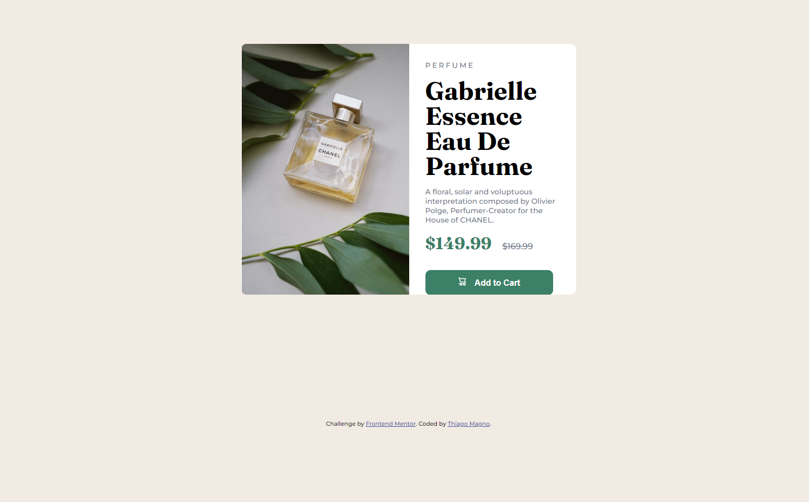

# Frontend Mentor - Product preview card component solution

This is a solution to the [Product preview card component challenge on Frontend Mentor](https://www.frontendmentor.io/challenges/product-preview-card-component-GO7UmttRfa). Frontend Mentor challenges help you improve your coding skills by building realistic projects. 

## Table of contents

- [Overview](#overview)
  - [The challenge](#the-challenge)
  - [Screenshot](#screenshot)
  - [Links](#links)
- [My process](#my-process)
  - [Built with](#built-with)
  - [What I learned](#what-i-learned)
  - [Continued development](#continued-development)
  - [Useful resources](#useful-resources)
- [Author](#author)

**Note: Delete this note and update the table of contents based on what sections you keep.**

## Overview

### The challenge

Users should be able to:

- View the optimal layout depending on their device's screen size
- See hover and focus states for interactive elements

### Screenshot
Mobile solution


Desktop solution


### Links

- Solution URL: [Add solution URL here](https://your-solution-url.com)
- Live Site URL: [Add live site URL here](https://elaborate-empanada-472c2e.netlify.app)

## My process

### Built with

- Semantic HTML5 markup
- CSS custom properties
- CSS Grid
- Mobile-first workflow
- [React](https://reactjs.org/) - 


### What I learned

In this I learned how to switch between images with html eve though I dont really understand the process behind it 

To see how you can add code snippets, see below:

```html
        
      
```


### Continued development

Instead of using HTML to switch the images I want to try usin JS next time, since it might be easier than using HTML. 


### Useful resources

- [Example resource 1](https://developer.mozilla.org/pt-BR/docs/Learn/HTML/Multimedia_and_embedding/Responsive_images) - This helped me with changing the images with HTML. 
## Author

- Frontend Mentor - [@Thiago-Magnoyourusername](https://www.frontendmentor.io/profile/Thiago-Magno)

